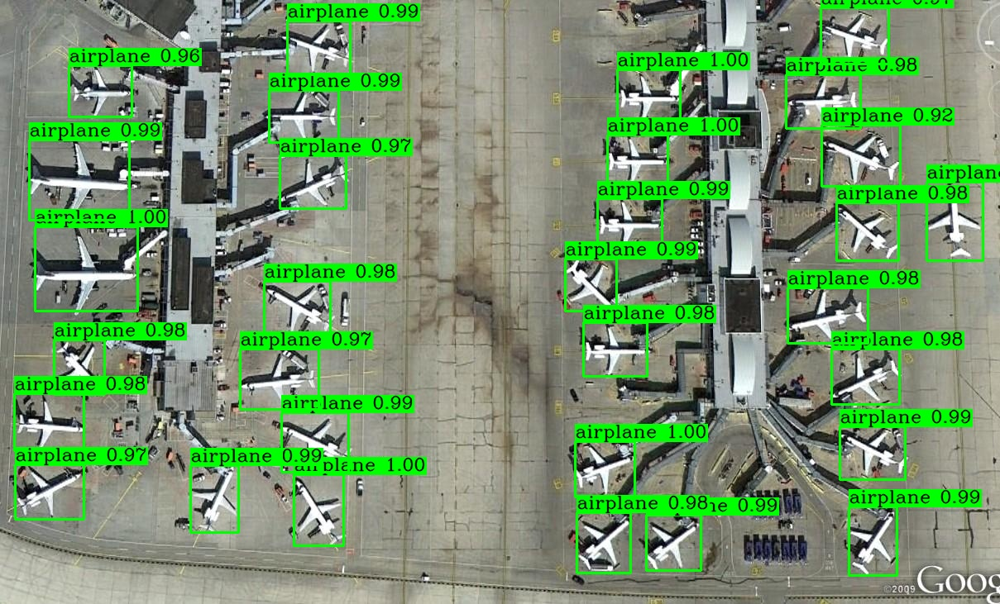
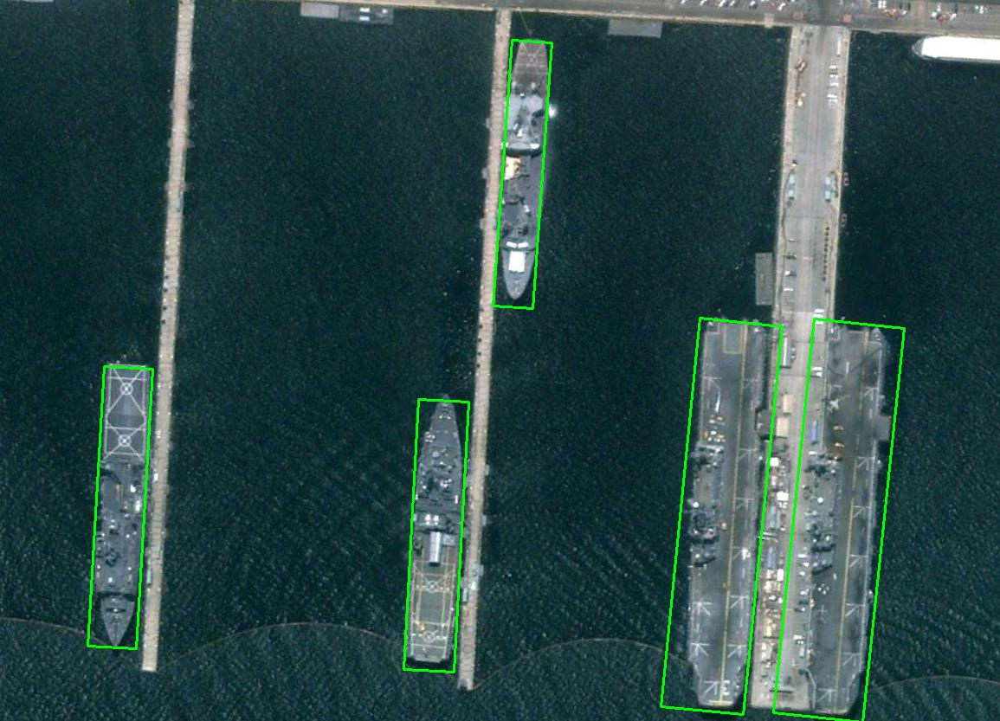

# Cascade-Rotated-RetinaNet

The codes build rotated cascade retinanet for arbitrary-oriented object detection. It supports the following datasets: DOTA, HRSC2016, ICDAR2013, ICDAR2015, UCAS-AOD, NWPU VHR-10, VOC2007, MSRA-TD500. 

## Getting Started
### Installation
```
cd $ROOT/utils
sh make.sh

cd $ROOT/datasets/DOTA_devkit
sudo apt-get install swig
swig -c++ -python polyiou.i
python setup.py build_ext --inplace

pip install requirements.txt
pip install git+git://github.com/lehduong/torch-warmup-lr.git
```

### Inference

```
python demo.py
```

### Train
1. prepare dataset and move it into the `$ROOT` directory.
2. generate imageset files:
```
cd $ROOT/datasets
python generate_imageset.py
```
3. start training:
```
python train.py
```
### Evaluation
prepare labels, take hrsc for example:
```
cd $ROOT/datasets/evaluate
python hrsc2gt.py
```
start evaluation:
```
python eval.py
```
### Detections





### Contact me

[Homepage](https://ming71.github.io/) | [Github](https://github.com/ming71) | [zhihu](https://www.zhihu.com/people/hua-qian-shu-18) 


